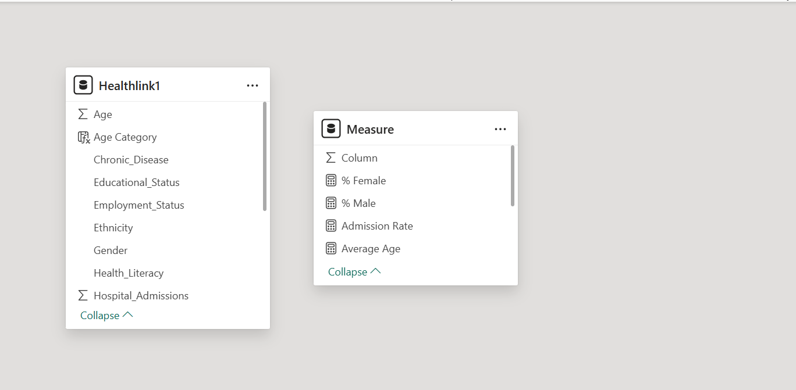
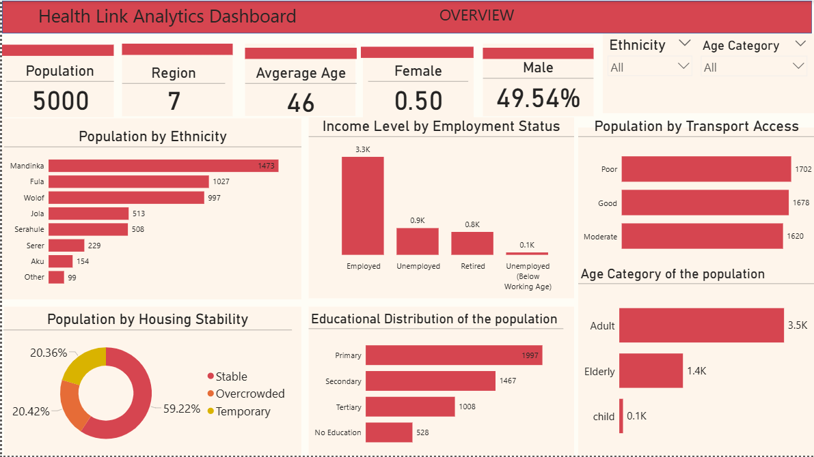

# Healthlink-Analysis

---

## Introduction
**HealthLink Analytics** is a healthcare data solutions provider specializing in addressing healthcare disparities by integrating and analyzing Social Determinants of Health (SDOH). By combining clinical and socioeconomic data, HealthLink empowers stakeholders to allocate resources more effectively and improve health outcomes, particularly in underserved communities.

## Problem Statement 
HealthLink Analytics faces a significant business challenge in its mission to address healthcare disparities in underserved communities. The company struggles with **Data fragmentation**, as critical datasets such as demographic information and health records remain siloed, preventing a comprehensive view of the factors influencing health outcomes. This was compounded by **Manual data processing**, which introduced inefficiencies and increased the risk of errors, slowing down the delivery of actionable insights. Additionally, the lack of **real-time insights** hindered proactive interventions, delaying responses to emerging health issues. Finally, **geospatial data** gaps limit the ability to analyze and visualize geographic disparities, restricting the targeted allocation of resources. These issues created a barrier to HealthLink’s goal of improving healthcare delivery and equity, highlighting the need for an integrated, automated solution to analyze and address these disparities.

## Skills
The following power BI features were incorporated 
- DAX,
- Measures,
- Modelling,
- Visualiztion.

## Modelling:
Automatically derived relationships are not adjusted

Automatic Model
:-----------------:

## Visualization

The report comprises two pages
1. The Overview page
2. SDOH impact and equity

## Analysis

---
Overview
The hospital currently have a total number 5000 patient
we have patient from 7 regions that access our hospital facilities
The average age of the patient is 46 years
The Adult patient has the highest percentage of our patient
The most of our patient are living in an overcowded houses that why there is high rate of re-admission

![](
SDOH Impact and Equilty

